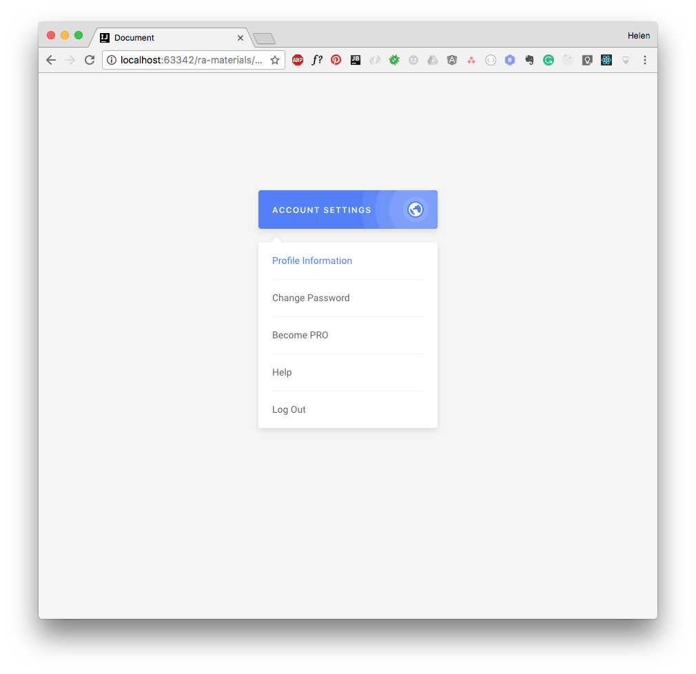

[Выпадающий список](https://wee-owl.github.io/ra_events-state_dropdown/)
===

Необходимо реализовать компоненты выпадающего списка.

## Описание проекта

Реализуйте компонент `DropdownList`, аналогичный указанному на рисунке. Для позиционирования выпадающего списка воспользуйтесь контейнером с `position: relatvie`. 

Структура компонентов:
- `Dropdown` — содержит кнопку и `DropdownList`, внутри себя хранит состояние, показывать или нет выпадающий список;
- `DropdownList` — содержит список `DropdownItem` и хранит информацию о текущем выбранном элементе.

Задача:
1. При клике на кнопку показывать и скрывать выпадающее меню.
2. Отрисовывать список на базе массива, хранящегося в памяти, через `map`.
3. Подсвечивать выбранный элемент в списке (на базе inline-стилей).
